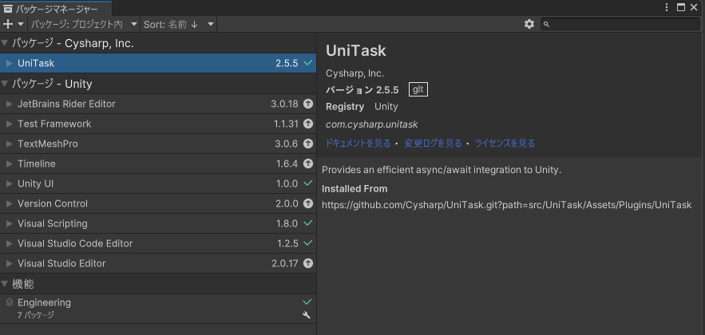
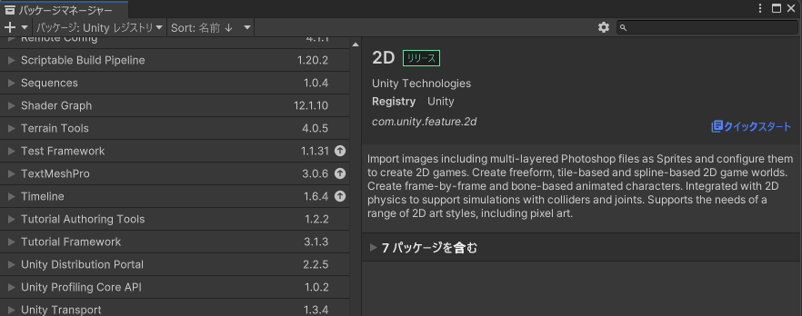

# VQUtageReadout

Unity用ビジュアルノベルツール「宴」用読み上げ合成音声生成プラグイン

## 概要

VQUtageReadoutは、Unity用のビジュアルノベルツール「宴」のバージョン3およびバージョン4に対応した読み上げ合成音声生成プラグインです。

このプラグインを使用することで、ゲーム製作者はシナリオのテキストを合成音声で読み上げる機能をゲームに組み込むことができます。

これにより、プレイヤーは視覚だけでなく聴覚でも物語を楽しむことができ、ゲーム体験の幅が広がります。

## 機能

- 台詞・地の文の読み上げ
- キャラクター名別の声の種類の選択
- 読み上げに使用するソフトウェアとしてVOICEVOX、VOICEROID+EX、Style-Bert-VITS2に対応

## 注意事項

- Unity用ビジュアルノベルツール「宴」の購入およびインストールが別途必要です。
- VOICEVOX、VOICEROID+EX、Style-Bert-VITS2の各ソフトウェアについては、キャストごとの読み上げ設定で選択して使用するもののみインストールおよび設定が必要です。例えば、VOICEVOXで読み上げるキャストのみを設定している場合は、VOICEVOXのみが必要です。
- ゲーム開始前にシナリオ中のすべての音声を生成するため、音声生成には時間がかかる場合があります。
- プラグインの動作には「宴3」または「宴4」に対応するUnityの特定のバージョンが必要です。使用するUnityバージョンに対応していることを確認してください。

## インストール方法

**注：宴をインストール済みのユーザーは、3から開始してください。**

### 1. Unity新規プロジェクトセットアップ

**1-1** Unity Hubを開き、新しいプロジェクトを作成します。

**1-2** プロジェクトのテンプレートとして「3D」を選択し、適切なプロジェクト名と保存場所を指定します。

**1-3** 「Create Project（作成）」ボタンをクリックしてプロジェクトを作成します。

### 2. 宴のインストール

**2-1** 「宴」公式サイトの[こちらのドキュメント](https://madnesslabo.net/utage/?page_id=631)を参照して、宴をインストールしてください。購入先によって手順が異なる点に注意してください。

### 3. VQUtageReadoutの依存ソフトウェアインストール

VQUtageReadoutを使用するには、以下の依存ソフトウェアをインストールする必要があります。

- UniTask
- Unity NuGet
- microsoft.extensions.logging
- RemoteTalk
- Settings / Config file
- newtonsoft.json
- UnityWav

**3-1** Unity Package Managerを使用して、UniTaskをインストールします。

まず、「Window（ウィンドウ）」＞「Package Manager（パッケージマネージャー）」とクリックして、Package Managerを開きます。

**3-2** 「＋」をクリックし、「GIT URLからパッケージを加える」を選択します。

**3-3** 開いた欄に、

「 https://github.com/Cysharp/UniTask.git?path=src/UniTask/Assets/Plugins/UniTask 」

を入力して「追加」ボタンをクリックします。

**3-4** UniTaskのインストールが完了するまで、しばらく待ちます。

**3-5** UniTaskのインストールが完了したことを確認して、次に移ります。

**3-6** Unity NuGetの設定を行います。まず、「Edit（編集）」＞「Project Settings（プロジェクト設定）」とクリックして、Project Settingsウィンドウを開きます。

**3-7** Project Settingsウィンドウ画面左から、項目「パッケージマネージャー」を開きます。

**3-8** Scoped Registriesの「Name（名前）」「URL」「Scope(s)」に、それぞれ

「Unity NuGet」

「https://unitynuget-registry.azurewebsites.net」

「org.nuget」

を入力し、「Apply（保存）」ボタンをクリックします。

**3-9** microsoft.extensions.loggingのインストールを行います。「Window（ウィンドウ）」＞「Package Manager（パッケージマネージャー）」とクリックして、Package Managerを開きます。

**3-10** パッケージマネージャー左上、左から二番目のメニューを開き、「Packages: My Registries（パッケージ：マイレジストリ）」を選択します。ウィンドウ右上の検索ウィンドウに「logging」を入力します。一覧に現れる、「Microsoft.Extensions.Logging（NuGet）」を選択し、「Install（インストール）」をクリックします。

**3-11** インストールが完了するまで待つと、「Microsoft.Extensions.Logging（NuGet）」および「Microsoft.Extensions.Logging.Abstractions（NuGet）」の右側に緑色のチェックマークがつきます。以上でmicrosoft.extensions.loggingのインストールが終了しました。

**3-12** RemoteTalkのインストールを行います。「Window（ウィンドウ）」＞「Package Manager（パッケージマネージャー）」とクリックして、Package Managerを開きます。

**3-13** パッケージマネージャー左上の「＋」ボタンをクリックし、「GIT URLからパッケージを加える...」をクリックします。

**3-14** 開いた入力欄に

「https://github.com/i-saint/RemoteTalk.git」

を入力し、「追加」ボタンをクリックします。

**3-15** パッケージマネージャー左上、左から二番目のメニューの項目Package: In Project（パッケージ：プロジェクト）内に、RemoteTalkが追加されていればRemoteTalkのインストール終了です。

**3-16** 次に、設定ファイル作成用アセット「Settings / Config file」を追加します。まず、ブラウザで

「 https://assetstore.unity.com/packages/tools/settings-config-file-81722 」

にアクセスします。Unity Asset Storeの「Settings / Config file」のページが開くので、ここで自分のアカウントに追加します。

**3-17** Unityエディタの操作に戻ります。「Window（ウィンドウ）」＞「Package Manager（パッケージマネージャー）」とクリックして、Package Managerを開きます。

**3-18** パッケージマネージャー右上の検索入力欄に、「setting」と入力します。一覧に「Settings / Config file」が表示されるので、「Download（ダウンロード）」ボタンをクリックした後、「Import（インポート）」ボタンに変わるのでそれをクリックしてインポートします。

**3-19** Newtonsoft.Jsonのインストールを行います。「Window（ウィンドウ）」＞「Package Manager（パッケージマネージャー）」とクリックして、Package Managerを開きます。

**3-20** パッケージマネージャー左上、左から二番目のメニューを開き、「Package: Unity Registry（パッケージ：Unityレジストリ）」を選択します。

**3-21** パッケージマネージャー左上の「＋」ボタンをクリックし、「Add package by name（名前でパッケージを加える...）」をクリックします。

**3-22** 開いた入力欄に

「com.unity.nuget.newtonsoft-json」

を入力し、「追加」ボタンをクリックします。

**3-23** インストールが完了するまで待つと、「Newtonsoft Json」の右側に緑色のチェックマークがつきます。以上でNewtonsoft.Jsonのインストールが終了しました。

**3-24** Wav Utility for Unityのインストールを行います。[配布元Githubページ](https://github.com/deadlyfingers/UnityWav)にアクセスし、「WavUtility.cs」のリンクをクリックします。

**3-25** 開いたページの「Download Raw File」ボタンをクリックし、「WavUtility.cs」ファイルをダウンロードします。

**3-26** ダウンロードした「WavUtility.cs」ファイルを、Unityのプロジェクトウィンドウ中に、フォルダ「Assets/deadlyfingers/UnityWav/」を作り、ドラッグアンドドロップします。以上でWav Utility for Unityのインストールが終了しました。

### 4. VQUtageReadoutのインストール

**4-1** VQUtageReadout_1.0.0.unitypackage.unitypackage（※バージョン番号部分はご利用のバージョンに読み替えてください）を実行し、Unityにインポートします。

**4-2** インポートが完了し、Unityのメニューバー（画面上部）に「Vestalis Quintet」の項目が表示されたらVQUtageReadoutのインストールが終了しました。

## 使い方

VQUtageReadoutを利用するには、宴のプロジェクトを含むシーンを開き、その上でVQUtageReadoutの必須コンポーネントを配置・設定する必要があります。

VQUtageReadoutには、必須コンポーネントを宴のプロジェクトを含むシーンに自動配置する補助機能が含まれています。

以下の手順は、補助機能を使用した場合のVQUtageReadoutの必須コンポーネント配置と、実際に読み上げ機能を利用するまでを紹介しています。

**注：宴のプロジェクトを作成済みのユーザーは、2から開始してください。**

### 1. 宴の新規プロジェクトを作成する

**1-1** 「Tools（ツール）」＞「Utage」＞「New Project」とクリックして、宴の新規プロジェクト作成ウィンドウを開きます。

**1-2** New Projectウィンドウが開きました。必要事項を記入して、新しい宴プロジェクトを含んだシーンを作成します。

**1-3** 宴の新規プロジェクトがヒエラルキーに配置されたシーンに切り替わります。

### 2. VQUtageReadoutの必須コンポーネント配置補助機能を利用して必須コンポーネントをヒエラルキーに自動配置する

**2-1** 「VestalisQuintet」＞「VQUtageReadOut」＞「コンポーネント自動設定」とクリックして、VQUtageReadoutのコンポーネント自動設定ウィンドウを開きます。

**2-2** 「VQUtageReadOut自動設定」ウィンドウの下部にある、「自動設定実行」ボタンをクリックします。

**2-3** 「VQUtageReadOut自動設定」ウィンドウのテキストボックス全てに「[OK]設定済」が表示されていれば、VQUtageReadoutの必須コンポーネントの配置は完了です。

### 3. 読み上げ機能の準備完了まで宴のUIを隠す設定

ここまでの状態では、ゲームを起動した際に宴のUIが表示されたままになっています。

読み上げ機能の準備が終わるまでは宴のUIを非表示にしておくため、次の設定を行います。

**3-1** Unityのヒエラルキーを確認し、宴のUIのゲームオブジェクトを選択します。

**3-2** Unityのインスペクターを確認し、「Canvas-AdvUI」左のチェックマークを外します。

以上で読み上げ機能の準備完了まで宴のUIを隠す設定は完了です。

### 4. 読み上げ音声の種類、キャラクター別の設定を割り当てる

宴の出演キャラクターごとに、割り当てる読み上げ音声の種類を設定できます。

設定を行う為には、Unityのヒエラルキーを確認し、「SettingSingleton」オブジェクトを選択して「Utage Setting」コンポーネントの項目を編集する必要があります。

**4-1** Use Read Outチェックボックスにチェックを入れる

この項目にチェックを入れている場合、宴の実行中に音声読み上げを実行します。

**4-2** Use Generate Voiceチェックボックスにチェックを入れる

この項目にチェックを入れている場合、宴の開始時にシナリオを解析し、読み上げ音声の生成を実行します。

**4-3** （VOICEVOXを利用する場合）Voice Vox Base UrlテキストボックスにVoice Voxサーバを実行中のURLを指定する

宴を実行するコンピュータ上でVOICEVOXを標準設定で起動している場合、通常デフォルトから変更する必要はありません。

**4-4** （VOICEVOXを利用する場合）Voice Vox PortテキストボックスにVoice Voxサーバを実行中のポート番号を指定する

宴を実行するコンピュータ上でVOICEVOXを標準設定で起動している場合、通常デフォルトから変更する必要はありません。

**4-5** （Style-Bert-VITS2を利用する場合）Style Bert Vits2 Base UrlテキストボックスにStyle-Bert-VITS2サーバを実行中のURLを指定する

宴を実行するコンピュータ上でStyle-Bert-VITS2を標準設定で起動している場合、通常デフォルトから変更する必要はありません。

**4-6** （Style-Bert-VITS2を利用する場合）Style Bert Vits2 Base UrlテキストボックスにStyle-Bert-VITS2サーバを実行中のポート番号を指定する

宴を実行するコンピュータ上でStyle-Bert-VITS2を標準設定で起動している場合、通常デフォルトから変更する必要はありません。

**4-7** Cast Reader ID Listに、声を設定したいキャラクター別の情報を追加する

キャラクターごとに下記の項目を記入して、読み上げ音声の設定を行います。

- Cast Name

  全てのReader Typeで必須項目。
  
  宴のシナリオファイルで利用しているキャラクター名（メッセージウィンドウの名前欄に表示される名前）と一致した場合、この読み上げ音声設定を利用します。

- Reader Type

  全てのReader Typeで必須項目。
  
  読み上げソフトの種類を設定します（`VoiceVox`、`StyleBertVits2`など）。

- Speaker Name

  Reader TypeがVOICEVOX、またはStyle-Bert-VITS2の場合必須項目。

  話者名を設定します。

- Model Name

  Reader TypeがStyle-Bert-VITS2の場合必須項目。

  読み上げモデル名を設定します。

- Style Name

  Reader TypeがVOICEVOX、またはStyle-Bert-VITS2の場合必須項目。

  読み上げスタイル名を設定します。

- Reader Exe Path

  Reader TypeがRemoteTalkの場合必須項目。

  読み上げソフトのパスをフルパスで設定します。

また、Cast Nameが【デフォルト】または【地の文】の場合、特別な読み上げ音声指定となります。

【デフォルト】の場合、他のどのキャラクターの設定にも当てはまらないメッセージウィンドウのテキストをこの【デフォルト】の設定で読み上げます。

【地の文】の場合、メッセージウィンドウの名前欄に何も入っていない場合のテキストをこの【地の文】の設定で読み上げます。

**4-8** シナリオの既存のボイスを読み上げで上書きしたい場合、 Override Part Voice By ReadOutチェックボックスにチェックを入れる

以上で読み上げ音声の種類、キャラクター別の設定は終了です。

## 音声読み上げデータの生成とゲーム上での音声読み上げ実行

- 読み上げにVOICEVOXやStyle-Bert-VITS2、VOICEROID+EXを使用する場合、ゲームを起動する前に予めそれらをサーバとして起動しておく必要があります。

- 音声読み上げ設定を全て行い、「useReadOut」と「useGenerateVoice」にチェックが入った状態でゲームを起動すると、音声読み上げデータの生成が始まります。

- 生成された音声はゲームの実行ファイルがあるフォルダ直下、またはUnityプロジェクトフォルダ直下の「voicewavout」フォルダに保存されます。

- 一度音声を生成した後は、二度目以降に起動した場合には再度生成は行われません。音声生成をやり直したい場合、「voicewavout」フォルダを削除して、再び「useGenerateVoice」にチェックを入れた状態でゲームを起動しなおしてください。

- 宴でノベルゲーム本編を起動すると、テキストメッセージの表示時に音声読み上げが実行されます。

## 設定

1. Unityエディターでプロジェクトを開きます。
2. コンポーネント自動設定を実行済みか、手動でVQUtageReadoutの関連コンポーネントを追加していることを確認します。
2. `SettingsSingleton`オブジェクトにアタッチされている`UtageSettings`スクリプトを使用して設定を行います。

### UtageSettingsの設定項目

- `useReadOut`：宴上で読み上げ機能を使用するかどうかを設定します（生成した音声ファイルを読み上げるかどうか）。
- `useGenerateVoice`：ゲーム起動時に音声生成を実行するかどうかを設定します。
- `voiceVoxBaseUrl`：VOICEVOX APIのベースURLを設定します。
- `voiceVoxPort`：VOICEVOX APIのポート番号を設定します。
- `styleBertVits2BaseUrl`：Style-Bert-VITS2のベースURLを設定します。
- `styleBertVits2Port`：Style-Bert-VITS2のポート番号を設定します。
- `castReaderIDList`：キャストごとの読み上げ設定を行います。各キャストの設定には以下の項目があります：
  - `castName`：シナリオファイル上のキャスト名を設定します。
  - `readerType`：読み上げソフトの種類を設定します（`VoiceVox`、`StyleBertVits2`など）。
  - `speakerName`：話者名を設定します。
  - `modelName`：読み上げモデル名を設定します。
  - `styleName`：読み上げスタイル名を設定します。
  - `readerExePath`：読み上げソフトのパスを設定します。
- `overridePartVoiceByReadOut`：生成した読み上げ音声が、シナリオファイルに設定しているボイスに優先して再生されるかどうかを設定します。

#### 設定のファイル保存

UtageSettingsの設定項目は、ゲームの実行ファイルと同じフォルダに「Settings.txt」として保存することで上書きが可能です。

UtageSettingsコンポーネントの下部、「Save to File」ボタンをクリックする事で、Assets/FilesToCopy/ フォルダにettings.txtファイルを保存することができます。

上記のUtageSettingsの設定項目がjson形式で保存されていますので、json形式に従ってテキストとして変更する事も可能です。

## ライセンス

VQUtageReadoutはMITライセンスの下で公開されています。詳細については、同梱のLICENSEファイルを参照してください。

### 使用している他のMITライセンスプロジェクト

本プラグインには、以下のMITライセンスプロジェクトが含まれています：

- [Wav Utility for Unity](https://github.com/deadlyfingers/UnityWav): 読み上げデータのwavファイルへの保存に使用
- [UniTask](https://github.com/Cysharp/UniTask): 非同期処理に使用
- [RemoteTalk](https://github.com/i-saint/RemoteTalk): VOICEROIDとの通信に使用
- [Newtonsoft.Json](https://github.com/JamesNK/Newtonsoft.Json): APIとの通信用jsonデータのシリアライズ・デシリアライズに使用

### 使用している他のUnityアセット（標準Unity Asset Store EULA）

- [宴](https://assetstore.unity.com/packages/tools/game-toolkits/utage4-for-unity-text-adventure-game-engine-version4-266447): ゲームエンジン
- [Settings / Config file](https://assetstore.unity.com/packages/tools/settings-config-file-81722): 設定ファイルの読み書きに使用

## サポート

ご質問や問題がある場合は、以下の方法でサポートを受けることができます：

- GitHubのイシュー: [GitHubリポジトリ](https://github.com/VestalisQuintet/VQUtageReadout/issues)

サポートは可能な限り提供いたしますが、迅速さや確実性を約束するものではありません。あらかじめご了承ください。

## 制作

Vestalis Quintet
